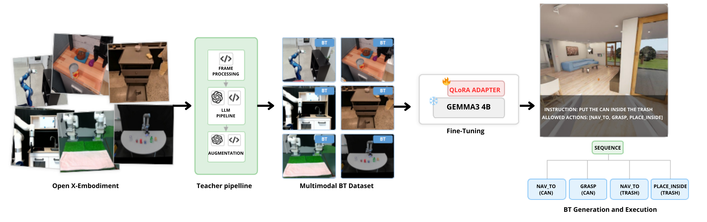

# Multimodal Behavior Tree Generation: A Small Vision-Language Model for Robot Task Planning

## Overview
Large language models have been widely used for robotic task planning, often taking advantage of representations such as Behavior Trees (BTs). Vision-Language Models (VLMs) have extended these works by grounding the generated plans in the observed scene. However, existing methods are either text-only or rely on large proprietary VLMs, while no dataset pairs visual observations and task instructions with executable and ROS2-compatible BTs. We address this gap with a multi-stage teacher pipeline that converts 1,622 Open X-Embodiment episodes into an augmented multimodal BT dataset containing 2,433 examples. We use this dataset to fine-tune compact and open-source VLMs, ranging from 500M to 4B parameters, using parameter-efficient fine-tuning (PEFT). We then evaluate the generated BTs offline in terms of syntactic correctness and by executing them on 15 household tasks in BEHAVIOR-1K. Our best model, Gemma-3 4B, achieves perfect BT validity and an 87% success rate, outperforming Claude Opus 4.8 and approaching GPT-5, while running locally. Finally, our ablation studies show that adding visual observations increases task success from 40% to 87%, while data augmentation increases BT validity from 65% to 100%.

> [!WARNING]
> The manuscript is under review, and the source code and dataset will be released after publication.

**Authors**: [Riccardo Andrea Izzo](mailto:riccardo.izzo@mail.polimi.it), [Cristiano Battistini](mailto:cristiano.battistini@mail.polimi.it), [Gianluca Bardaro](mailto:gianluca.bardaro@polimi.it) and [Matteo Matteucci](mailto:matteo.matteucci@polimi.it)  
**Location**: [**AIRLab** (The Artificial Intelligence and Robotics Lab of Politecnico di Milano)](https://airlab.deib.polimi.it/)

